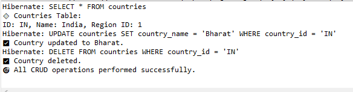

Hibernate CRUD Project

A simple Java Maven project demonstrating CRUD operations using Hibernate with PostgreSQL. 
Ideal for learning Hibernate integration,
configuration, and database interaction basics.

✨ Features
✅ Insert region and country records

✅ Retrieve and display country records

✅ Update country name

✅ Delete country data

🛠️ Technologies Used

Java

Hibernate ORM

PostgreSQL

Maven

🚀 Setup Instructions
Clone the repository

git clone https://github.com/Samarth-Thite/hibernate-crud.git

Import as Maven Project in Eclipse or IntelliJ.

Configure database credentials in hibernate.cfg.xml with your PostgreSQL username and password.

Run MainApp.java to perform all CRUD operations.

📂 Project Structure

hibernate-crud/
├── src/
│   ├── main/
│   │   ├── java/
│   │   │   └── simplehibernate/
│   │   │       └── MainApp.java
│   │   └── resources/
│   │       └── hibernate.cfg.xml
└── pom.xml

👤 Contact

Name: Samarth Thite 

Email: samarththite1010@gmail.com

GitHub: Samarth-Thite

 Output:
 

 

 
